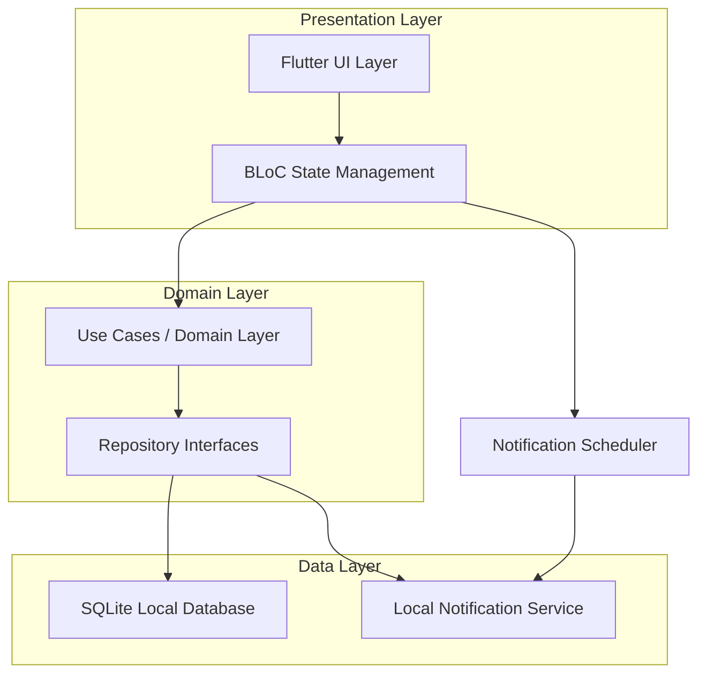
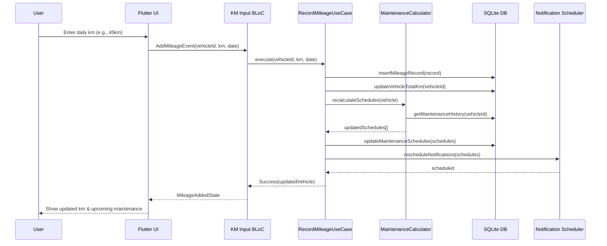
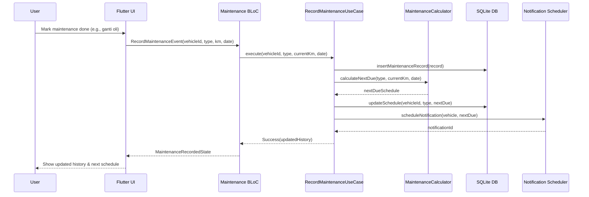

# Design Document: Fleet Maintenance Tracker

## Overview

Fleet Maintenance Tracker is a Flutter mobile application designed for small fleet owners in Indonesia who manage cars and motorcycles. The app enables daily kilometer input tracking, automatic maintenance schedule calculations based on both distance and time intervals, comprehensive maintenance history recording, and proactive notifications alerting owners about upcoming maintenance needs.

The core value proposition is predictive maintenance scheduling — the app calculates when each vehicle component (oil, tires, brake pads, etc.) needs servicing based on actual usage patterns (daily km input) and time elapsed since last service. This eliminates the guesswork for fleet owners managing multiple vehicles with different maintenance cycles.

The app targets Indonesian market users managing fleets of 2-20 vehicles (cars and motorcycles), with maintenance intervals following manufacturer recommendations common in Indonesia (e.g., oil change every 2000km for motorcycles, 5000-10000km for cars).

## Architecture



The architecture follows Clean Architecture with three layers:
- **Presentation Layer**: Flutter widgets with BLoC pattern for state management
- **Domain Layer**: Business logic, use cases, and repository interfaces
- **Data Layer**: SQLite for local persistence, flutter_local_notifications for scheduling

## Sequence Diagrams

### Daily KM Input Flow



### Maintenance Completion Flow



## Components and Interfaces

### Component 1: Vehicle Management

**Purpose**: Manages vehicle CRUD operations and stores vehicle metadata.

```dart
abstract class VehicleRepository {
  Future<List<Vehicle>> getAllVehicles();
  Future<Vehicle?> getVehicleById(String id);
  Future<void> addVehicle(Vehicle vehicle);
  Future<void> updateVehicle(Vehicle vehicle);
  Future<void> deleteVehicle(String id);
  Future<void> updateTotalMileage(String vehicleId, double totalKm);
}
```

**Responsibilities**:
- Store and retrieve vehicle information (name, type, plate number, year)
- Track total accumulated mileage per vehicle
- Support multiple vehicle types (car, motorcycle)

### Component 2: Mileage Tracking

**Purpose**: Records daily kilometer inputs and maintains mileage history.

```dart
abstract class MileageRepository {
  Future<void> addMileageRecord(MileageRecord record);
  Future<List<MileageRecord>> getMileageHistory(String vehicleId, {DateTime? from, DateTime? to});
  Future<double> getTotalMileage(String vehicleId);
  Future<double> getAverageDailyMileage(String vehicleId, {int lastDays = 30});
}
```

**Responsibilities**:
- Record daily km input with date and optional notes
- Calculate total and average daily mileage
- Provide mileage history for reporting

### Component 3: Maintenance Calculator

**Purpose**: Core business logic that calculates when maintenance is due based on km and time.

```dart
abstract class MaintenanceCalculator {
  MaintenanceSchedule calculateNextDue({
    required MaintenanceType type,
    required VehicleType vehicleType,
    required double currentTotalKm,
    required DateTime lastServiceDate,
    required double lastServiceKm,
    required double avgDailyKm,
  });

  List<MaintenanceSchedule> recalculateAllSchedules(Vehicle vehicle);
  
  MaintenancePrediction predictDueDate({
    required double remainingKm,
    required double avgDailyKm,
    required DateTime dueByDate,
  });
}
```

**Responsibilities**:
- Calculate next maintenance due based on km interval and time interval
- Use average daily km to predict calendar date for km-based maintenance
- Determine which threshold (km or time) will be reached first
- Support different intervals per vehicle type

### Component 4: Notification Scheduler

**Purpose**: Manages proactive notifications for upcoming maintenance.

```dart
abstract class NotificationScheduler {
  Future<void> scheduleMaintenanceReminder({
    required String vehicleId,
    required MaintenanceType type,
    required DateTime notifyDate,
    required String title,
    required String body,
  });

  Future<void> cancelNotification(String notificationId);
  Future<void> rescheduleAllForVehicle(String vehicleId, List<MaintenanceSchedule> schedules);
  Future<List<ScheduledNotification>> getPendingNotifications();
}
```

**Responsibilities**:
- Schedule local notifications at calculated reminder dates
- Cancel and reschedule when maintenance is completed or km changes significantly
- Format notification messages in Indonesian (e.g., "Motor Vario 160 harus ganti ban 100km / 3 bulan lagi")

### Component 5: Maintenance History

**Purpose**: Records completed maintenance events.

```dart
abstract class MaintenanceHistoryRepository {
  Future<void> addMaintenanceRecord(MaintenanceRecord record);
  Future<List<MaintenanceRecord>> getHistory(String vehicleId, {MaintenanceType? type});
  Future<MaintenanceRecord?> getLastMaintenance(String vehicleId, MaintenanceType type);
  Future<Map<MaintenanceType, MaintenanceRecord>> getLastMaintenanceByType(String vehicleId);
}
```

**Responsibilities**:
- Store completed maintenance events with date, km, cost, and notes
- Retrieve last service record per maintenance type for schedule calculation
- Provide full history for reporting

## Data Models

### Vehicle

```dart
enum VehicleType { car, motorcycle }

class Vehicle {
  final String id;
  final String name;          // e.g., "Vario 160", "Avanza 2020"
  final VehicleType type;
  final String plateNumber;   // e.g., "B 1234 XYZ"
  final int year;
  final double totalMileageKm;
  final DateTime createdAt;

  const Vehicle({
    required this.id,
    required this.name,
    required this.type,
    required this.plateNumber,
    required this.year,
    required this.totalMileageKm,
    required this.createdAt,
  });
}
```

**Validation Rules**:
- `name` must be non-empty, max 50 characters
- `plateNumber` must follow Indonesian format (letter(s) space digits space letter(s))
- `year` must be between 1970 and current year + 1
- `totalMileageKm` must be >= 0

### Mileage Record

```dart
class MileageRecord {
  final String id;
  final String vehicleId;
  final double km;            // Daily km driven
  final DateTime date;
  final String? notes;

  const MileageRecord({
    required this.id,
    required this.vehicleId,
    required this.km,
    required this.date,
    this.notes,
  });
}
```

**Validation Rules**:
- `km` must be > 0 and <= 2000 (reasonable daily max)
- `date` must not be in the future
- One record per vehicle per day (upsert behavior)

### Maintenance Type & Intervals

```dart
enum MaintenanceType {
  oilChange,        // Ganti oli
  tireReplacement,  // Ganti ban
  brakePads,        // Ganti kampas rem
  airFilter,        // Ganti filter udara
  sparkPlug,        // Ganti busi
  chainLube,        // Pelumas rantai (motorcycle only)
  coolant,          // Ganti coolant
  brakeFluid,       // Ganti minyak rem
  transmission,     // Ganti oli transmisi
}

class MaintenanceInterval {
  final MaintenanceType type;
  final VehicleType vehicleType;
  final double kmInterval;          // km between services
  final int monthsInterval;         // months between services
  final double warningBeforeKm;     // warn this many km before due
  final int warningBeforeDays;      // warn this many days before due

  const MaintenanceInterval({
    required this.type,
    required this.vehicleType,
    required this.kmInterval,
    required this.monthsInterval,
    required this.warningBeforeKm,
    required this.warningBeforeDays,
  });
}
```

**Default Intervals (Indonesian market standards)**:

| Type | Motorcycle (km/months) | Car (km/months) | Warning |
|------|----------------------|----------------|---------|
| Oil Change | 2,000 / 3 | 5,000 / 6 | 200km / 14 days |
| Tire Replacement | 15,000 / 24 | 40,000 / 48 | 1,000km / 90 days |
| Brake Pads | 15,000 / 24 | 30,000 / 36 | 1,000km / 30 days |
| Air Filter | 8,000 / 12 | 20,000 / 12 | 500km / 30 days |
| Spark Plug | 8,000 / 12 | 30,000 / 24 | 500km / 30 days |
| Chain Lube | 500 / 1 | N/A | 50km / 7 days |
| Coolant | 20,000 / 24 | 40,000 / 24 | 1,000km / 30 days |
| Brake Fluid | 20,000 / 24 | 40,000 / 24 | 1,000km / 30 days |
| Transmission | 10,000 / 12 | 40,000 / 48 | 500km / 30 days |

### Maintenance Record

```dart
class MaintenanceRecord {
  final String id;
  final String vehicleId;
  final MaintenanceType type;
  final double mileageAtService;  // Total km when serviced
  final DateTime serviceDate;
  final double? cost;             // In IDR
  final String? notes;
  final String? workshopName;     // Nama bengkel

  const MaintenanceRecord({
    required this.id,
    required this.vehicleId,
    required this.type,
    required this.mileageAtService,
    required this.serviceDate,
    this.cost,
    this.notes,
    this.workshopName,
  });
}
```

### Maintenance Schedule

```dart
class MaintenanceSchedule {
  final String id;
  final String vehicleId;
  final MaintenanceType type;
  final double dueAtKm;           // Due when total km reaches this
  final DateTime dueByDate;        // Due by this date
  final double remainingKm;        // Km remaining until due
  final int remainingDays;         // Days remaining until due
  final bool isOverdue;
  final DateTime? estimatedDueDate; // Predicted date based on avg daily km

  const MaintenanceSchedule({
    required this.id,
    required this.vehicleId,
    required this.type,
    required this.dueAtKm,
    required this.dueByDate,
    required this.remainingKm,
    required this.remainingDays,
    required this.isOverdue,
    this.estimatedDueDate,
  });
}
```

## Algorithmic Pseudocode

### Main Maintenance Calculation Algorithm

```dart
/// Calculates the next maintenance schedule for a given type and vehicle.
/// 
/// This is the core algorithm that determines when maintenance is due
/// based on both km interval and time interval, taking the earlier of the two.
MaintenanceSchedule calculateNextMaintenanceSchedule({
  required MaintenanceType type,
  required Vehicle vehicle,
  required MaintenanceRecord? lastService,
  required MaintenanceInterval interval,
  required double avgDailyKm,
}) {
  // Step 1: Determine baseline (last service or vehicle creation)
  final double baseKm = lastService?.mileageAtService ?? 0;
  final DateTime baseDate = lastService?.serviceDate ?? vehicle.createdAt;

  // Step 2: Calculate km-based due point
  final double dueAtKm = baseKm + interval.kmInterval;
  final double remainingKm = dueAtKm - vehicle.totalMileageKm;

  // Step 3: Calculate time-based due point
  final DateTime dueByDate = DateTime(
    baseDate.year,
    baseDate.month + interval.monthsInterval,
    baseDate.day,
  );
  final int remainingDays = dueByDate.difference(DateTime.now()).inDays;

  // Step 4: Estimate calendar date for km-based due
  DateTime? estimatedDueDate;
  if (avgDailyKm > 0 && remainingKm > 0) {
    final int estimatedDays = (remainingKm / avgDailyKm).ceil();
    estimatedDueDate = DateTime.now().add(Duration(days: estimatedDays));
  }

  // Step 5: Determine overdue status
  final bool isOverdue = remainingKm <= 0 || remainingDays <= 0;

  return MaintenanceSchedule(
    id: generateId(),
    vehicleId: vehicle.id,
    type: type,
    dueAtKm: dueAtKm,
    dueByDate: dueByDate,
    remainingKm: remainingKm.clamp(0, double.infinity),
    remainingDays: remainingDays.clamp(0, 99999),
    isOverdue: isOverdue,
    estimatedDueDate: estimatedDueDate,
  );
}
```

**Preconditions:**
- `vehicle` is non-null with valid `totalMileageKm >= 0`
- `interval.kmInterval > 0` and `interval.monthsInterval > 0`
- `avgDailyKm >= 0`
- If `lastService` is not null, `lastService.mileageAtService <= vehicle.totalMileageKm`

**Postconditions:**
- Returns a valid `MaintenanceSchedule` with `dueAtKm > baseKm`
- `isOverdue == true` if and only if `remainingKm <= 0 OR remainingDays <= 0`
- `estimatedDueDate` is null only when `avgDailyKm == 0` or maintenance is already overdue
- `remainingKm >= 0` and `remainingDays >= 0` (clamped)

**Loop Invariants:** N/A (no loops in this function)

### Notification Message Generation Algorithm

```dart
/// Generates a human-readable notification message in Indonesian.
/// 
/// Format: "{Vehicle Name} harus {action} {remaining_km}km / {remaining_time} lagi"
/// Example: "Motor Vario 160 harus ganti ban 100km / 3 bulan lagi"
String generateNotificationMessage({
  required Vehicle vehicle,
  required MaintenanceSchedule schedule,
}) {
  // Step 1: Get vehicle prefix based on type
  final String prefix = vehicle.type == VehicleType.motorcycle ? 'Motor' : 'Mobil';

  // Step 2: Get maintenance action in Indonesian
  final String action = _getMaintenanceActionText(schedule.type);

  // Step 3: Format remaining km
  final String kmText = '${schedule.remainingKm.round()}km';

  // Step 4: Format remaining time in human-readable Indonesian
  final String timeText = _formatRemainingTime(schedule.remainingDays);

  // Step 5: Compose message
  return '$prefix ${vehicle.name} harus $action $kmText / $timeText lagi';
}

String _getMaintenanceActionText(MaintenanceType type) {
  switch (type) {
    case MaintenanceType.oilChange: return 'ganti oli';
    case MaintenanceType.tireReplacement: return 'ganti ban';
    case MaintenanceType.brakePads: return 'ganti kampas rem';
    case MaintenanceType.airFilter: return 'ganti filter udara';
    case MaintenanceType.sparkPlug: return 'ganti busi';
    case MaintenanceType.chainLube: return 'pelumas rantai';
    case MaintenanceType.coolant: return 'ganti coolant';
    case MaintenanceType.brakeFluid: return 'ganti minyak rem';
    case MaintenanceType.transmission: return 'ganti oli transmisi';
  }
}

String _formatRemainingTime(int days) {
  if (days <= 0) return 'sudah lewat';
  if (days < 7) return '$days hari';
  if (days < 30) return '${(days / 7).round()} minggu';
  if (days < 365) return '${(days / 30).round()} bulan';
  return '${(days / 365).round()} tahun';
}
```

**Preconditions:**
- `vehicle` is non-null with non-empty `name`
- `schedule` has `remainingKm >= 0` and valid `remainingDays`

**Postconditions:**
- Returns non-empty string in Indonesian language
- Message contains vehicle type prefix ("Motor" or "Mobil")
- Message contains vehicle name
- Message contains maintenance action
- Message contains remaining km and time

### Recalculate All Schedules Algorithm

```dart
/// Recalculates all maintenance schedules for a vehicle after a mileage update.
/// This is called after every daily km input.
Future<List<MaintenanceSchedule>> recalculateAllSchedules(Vehicle vehicle) async {
  // Step 1: Get average daily km (last 30 days)
  final double avgDailyKm = await mileageRepo.getAverageDailyMileage(
    vehicle.id,
    lastDays: 30,
  );

  // Step 2: Get applicable maintenance types for this vehicle
  final List<MaintenanceType> applicableTypes = _getApplicableTypes(vehicle.type);

  // Step 3: Get last maintenance record for each type
  final Map<MaintenanceType, MaintenanceRecord> lastServices =
      await maintenanceRepo.getLastMaintenanceByType(vehicle.id);

  // Step 4: Calculate schedule for each maintenance type
  final List<MaintenanceSchedule> schedules = [];
  
  for (final type in applicableTypes) {
    // Loop invariant: all previously calculated schedules are valid
    final interval = getDefaultInterval(type, vehicle.type);
    final lastService = lastServices[type];

    final schedule = calculateNextMaintenanceSchedule(
      type: type,
      vehicle: vehicle,
      lastService: lastService,
      interval: interval,
      avgDailyKm: avgDailyKm,
    );

    schedules.add(schedule);
  }

  // Step 5: Sort by urgency (overdue first, then by remaining km)
  schedules.sort((a, b) {
    if (a.isOverdue && !b.isOverdue) return -1;
    if (!a.isOverdue && b.isOverdue) return 1;
    return a.remainingKm.compareTo(b.remainingKm);
  });

  return schedules;
}

List<MaintenanceType> _getApplicableTypes(VehicleType vehicleType) {
  final allTypes = MaintenanceType.values.toList();
  if (vehicleType == VehicleType.car) {
    allTypes.remove(MaintenanceType.chainLube); // Cars don't have chains
  }
  return allTypes;
}
```

**Preconditions:**
- `vehicle` is non-null with valid `totalMileageKm`
- Database is accessible and contains valid records
- Default intervals are defined for all applicable maintenance types

**Postconditions:**
- Returns list of schedules covering all applicable maintenance types for the vehicle
- List is sorted by urgency (overdue first, then remaining km ascending)
- Each schedule has correctly calculated `remainingKm` and `remainingDays`
- Motorcycle schedules exclude car-only types and vice versa

**Loop Invariants:**
- All previously calculated schedules in `schedules` list are valid
- Each schedule corresponds to exactly one maintenance type
- No duplicate maintenance types in the result

## Key Functions with Formal Specifications

### Function: addDailyMileage()

```dart
Future<void> addDailyMileage(String vehicleId, double km, DateTime date) async {
  // Validate input
  assert(km > 0 && km <= 2000);
  assert(!date.isAfter(DateTime.now()));

  // Record mileage
  final record = MileageRecord(
    id: generateId(),
    vehicleId: vehicleId,
    km: km,
    date: date,
  );
  await mileageRepo.addMileageRecord(record);

  // Update vehicle total
  final vehicle = await vehicleRepo.getVehicleById(vehicleId);
  final updatedTotal = vehicle!.totalMileageKm + km;
  await vehicleRepo.updateTotalMileage(vehicleId, updatedTotal);

  // Recalculate and update schedules
  final updatedVehicle = vehicle.copyWith(totalMileageKm: updatedTotal);
  final schedules = await recalculateAllSchedules(updatedVehicle);
  await scheduleRepo.updateSchedules(vehicleId, schedules);

  // Reschedule notifications
  await notificationScheduler.rescheduleAllForVehicle(vehicleId, schedules);
}
```

**Preconditions:**
- `vehicleId` corresponds to an existing vehicle in the database
- `km > 0` and `km <= 2000`
- `date` is not in the future
- Only one mileage record per vehicle per day

**Postconditions:**
- A new `MileageRecord` exists in the database for the given vehicle and date
- `vehicle.totalMileageKm` is incremented by exactly `km`
- All maintenance schedules for the vehicle are recalculated
- Notifications are rescheduled based on updated schedules

### Function: recordMaintenanceCompleted()

```dart
Future<void> recordMaintenanceCompleted({
  required String vehicleId,
  required MaintenanceType type,
  required double currentMileage,
  required DateTime serviceDate,
  double? cost,
  String? notes,
  String? workshopName,
}) async {
  // Record the maintenance
  final record = MaintenanceRecord(
    id: generateId(),
    vehicleId: vehicleId,
    type: type,
    mileageAtService: currentMileage,
    serviceDate: serviceDate,
    cost: cost,
    notes: notes,
    workshopName: workshopName,
  );
  await maintenanceRepo.addMaintenanceRecord(record);

  // Recalculate the schedule for this type
  final vehicle = await vehicleRepo.getVehicleById(vehicleId);
  final schedules = await recalculateAllSchedules(vehicle!);
  await scheduleRepo.updateSchedules(vehicleId, schedules);

  // Update notifications
  await notificationScheduler.rescheduleAllForVehicle(vehicleId, schedules);
}
```

**Preconditions:**
- `vehicleId` corresponds to an existing vehicle
- `currentMileage >= 0` and `currentMileage <= vehicle.totalMileageKm`
- `serviceDate` is not in the future
- `type` is applicable to the vehicle type

**Postconditions:**
- A new `MaintenanceRecord` exists in the database
- The next due schedule for this maintenance type is recalculated from the new service point
- `remainingKm` and `remainingDays` are reset based on the new service record
- Notifications are updated to reflect the new schedule

## Example Usage

```dart
// Example 1: Adding a new motorcycle
final vario = Vehicle(
  id: 'v001',
  name: 'Vario 160',
  type: VehicleType.motorcycle,
  plateNumber: 'B 6789 XYZ',
  year: 2023,
  totalMileageKm: 5200,
  createdAt: DateTime(2023, 6, 1),
);
await vehicleRepo.addVehicle(vario);

// Example 2: Recording daily km input
await addDailyMileage('v001', 45, DateTime(2024, 1, 15));
// Vehicle total km is now 5245

// Example 3: Recording a completed oil change
await recordMaintenanceCompleted(
  vehicleId: 'v001',
  type: MaintenanceType.oilChange,
  currentMileage: 5200,
  serviceDate: DateTime(2024, 1, 10),
  cost: 75000, // IDR 75,000
  workshopName: 'Bengkel Pak Joko',
);
// Next oil change due at 7200km (5200 + 2000)

// Example 4: Checking upcoming maintenance
final schedules = await recalculateAllSchedules(vario);
for (final schedule in schedules) {
  if (schedule.remainingKm <= interval.warningBeforeKm) {
    final message = generateNotificationMessage(
      vehicle: vario,
      schedule: schedule,
    );
    // Output: "Motor Vario 160 harus ganti oli 1955km / 2 bulan lagi"
    print(message);
  }
}

// Example 5: Managing multiple vehicles
final avanza = Vehicle(
  id: 'v002',
  name: 'Avanza 2020',
  type: VehicleType.car,
  plateNumber: 'B 1234 ABC',
  year: 2020,
  totalMileageKm: 35000,
  createdAt: DateTime(2020, 3, 15),
);
await vehicleRepo.addVehicle(avanza);
await addDailyMileage('v002', 80, DateTime(2024, 1, 15));
```

## Correctness Properties

The following properties must hold for the system to be correct:

```dart
// Property 1: Mileage monotonicity
// Total mileage for a vehicle never decreases
// ∀ vehicle v, ∀ time t1 < t2:
//   v.totalMileageKm(t1) <= v.totalMileageKm(t2)

// Property 2: Schedule consistency after mileage update
// After adding km, remainingKm decreases by exactly the added amount
// ∀ schedule s, ∀ added km k:
//   s.remainingKm(after) == s.remainingKm(before) - k

// Property 3: Maintenance reset
// After recording maintenance of type T at km K,
// the next due for T is exactly K + interval.kmInterval
// ∀ maintenance record m of type T:
//   nextDue(T).dueAtKm == m.mileageAtService + interval(T).kmInterval

// Property 4: Overdue detection
// A schedule is overdue iff remainingKm <= 0 OR remainingDays <= 0
// ∀ schedule s:
//   s.isOverdue ⟺ (s.remainingKm <= 0 ∨ s.remainingDays <= 0)

// Property 5: Notification timing
// Notifications are scheduled at (dueDate - warningBeforeDays)
// ∀ notification n for schedule s:
//   n.notifyDate == s.estimatedDueDate - interval.warningBeforeDays
//   OR n.notifyDate == s.dueByDate - interval.warningBeforeDays
//   (whichever is earlier)

// Property 6: Vehicle type filtering
// Motorcycle-only maintenance types never appear for cars
// ∀ vehicle v where v.type == car:
//   chainLube ∉ v.schedules

// Property 7: Daily km bounds
// No single day's km record exceeds reasonable bounds
// ∀ mileageRecord r:
//   0 < r.km <= 2000

// Property 8: Average daily km is non-negative
// ∀ vehicle v:
//   avgDailyKm(v) >= 0

// Property 9: Schedule completeness
// Every applicable maintenance type has exactly one active schedule per vehicle
// ∀ vehicle v:
//   |v.activeSchedules| == |applicableTypes(v.type)|

// Property 10: Temporal ordering
// Service date is always <= current date and >= vehicle creation date
// ∀ maintenanceRecord m for vehicle v:
//   v.createdAt <= m.serviceDate <= now()
```

## Error Handling

### Error Scenario 1: Invalid Mileage Input

**Condition**: User enters km <= 0 or km > 2000
**Response**: Show inline validation error in Indonesian: "Masukkan jarak yang valid (1-2000 km)"
**Recovery**: Keep form open, clear invalid input, focus the km field

### Error Scenario 2: Duplicate Daily Entry

**Condition**: User tries to add mileage for a date that already has a record for that vehicle
**Response**: Show dialog: "Sudah ada catatan km untuk tanggal ini. Ganti dengan yang baru?"
**Recovery**: If confirmed, upsert the record. If cancelled, do nothing.

### Error Scenario 3: Database Write Failure

**Condition**: SQLite write fails (disk full, corruption)
**Response**: Show snackbar error: "Gagal menyimpan data. Coba lagi."
**Recovery**: Retry up to 3 times with exponential backoff. If still failing, queue the operation for later.

### Error Scenario 4: Notification Permission Denied

**Condition**: User denies notification permissions on the device
**Response**: Show banner: "Aktifkan notifikasi untuk mendapatkan pengingat perawatan kendaraan"
**Recovery**: App continues to work without notifications. Show in-app badges for upcoming maintenance instead. Periodically re-prompt for notification permissions.

### Error Scenario 5: Vehicle Deletion with History

**Condition**: User attempts to delete a vehicle that has maintenance history
**Response**: Show confirmation dialog: "Hapus kendaraan ini? Semua riwayat perawatan akan hilang."
**Recovery**: If confirmed, cascade delete all related records (mileage, maintenance, schedules, notifications). If cancelled, do nothing.

## Testing Strategy

### Unit Testing Approach

Focus unit tests on the maintenance calculation logic as it is the core business value:

- `calculateNextMaintenanceSchedule` with various combinations of km/time intervals
- `generateNotificationMessage` for all maintenance types and both vehicle types
- `recalculateAllSchedules` for correct sorting and filtering
- `_formatRemainingTime` for all time ranges (days, weeks, months, years)
- Validation logic for mileage records and vehicles

### Property-Based Testing Approach

**Property Test Library**: `fast_check` (Dart) or custom generators

Key properties to test with random inputs:
1. Remaining km always decreases when mileage increases
2. Schedule overdue flag is consistent with remaining km/days
3. Notification messages are always non-empty and contain vehicle name
4. Average daily km is always >= 0
5. Schedule list always contains correct number of items per vehicle type

### Integration Testing Approach

- Full flow: Add vehicle → Add daily km → Check schedule updates
- Full flow: Record maintenance → Verify schedule resets
- Notification scheduling: Verify correct notification timing after various inputs
- Database persistence: Verify data survives app restart
- Multi-vehicle: Verify operations on one vehicle don't affect another

## Performance Considerations

- **Database queries**: Use indexes on `vehicleId` and `date` columns for mileage and maintenance tables
- **Schedule recalculation**: Only recalculate on mileage input or maintenance completion, not on every app open
- **Notification batching**: Group notification reschedules to avoid excessive system calls
- **History queries**: Paginate maintenance history (20 records per page)
- **Average calculation**: Cache the 30-day average daily km, invalidate on new mileage input

## Security Considerations

- **Local data only**: All data stored locally on device (SQLite), no cloud sync in v1
- **No sensitive data**: App doesn't store financial info beyond optional cost field
- **Backup**: Support local backup/export to prevent data loss
- **Input sanitization**: Sanitize all text inputs (notes, workshop names) before storage

## Dependencies

| Package | Purpose | Version |
|---------|---------|---------|
| `flutter_bloc` | State management (BLoC pattern) | ^8.x |
| `sqflite` | SQLite local database | ^2.x |
| `flutter_local_notifications` | Local push notifications | ^17.x |
| `uuid` | Generate unique IDs | ^4.x |
| `equatable` | Value equality for models | ^2.x |
| `path_provider` | Access device file system | ^2.x |
| `intl` | Date formatting and Indonesian locale | ^0.x |
