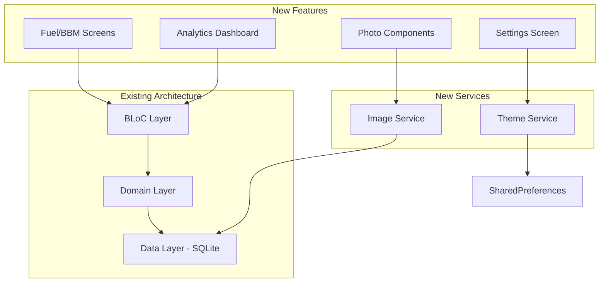
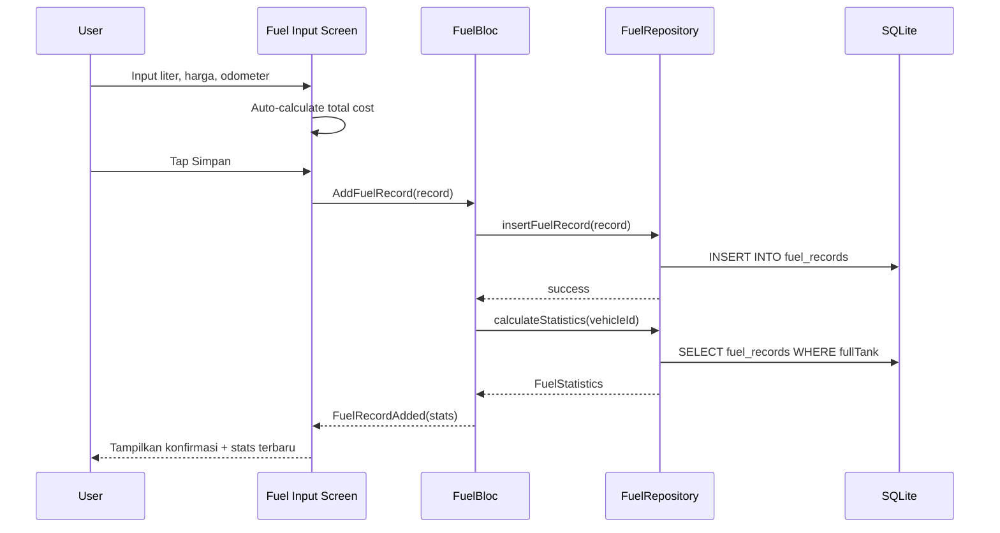
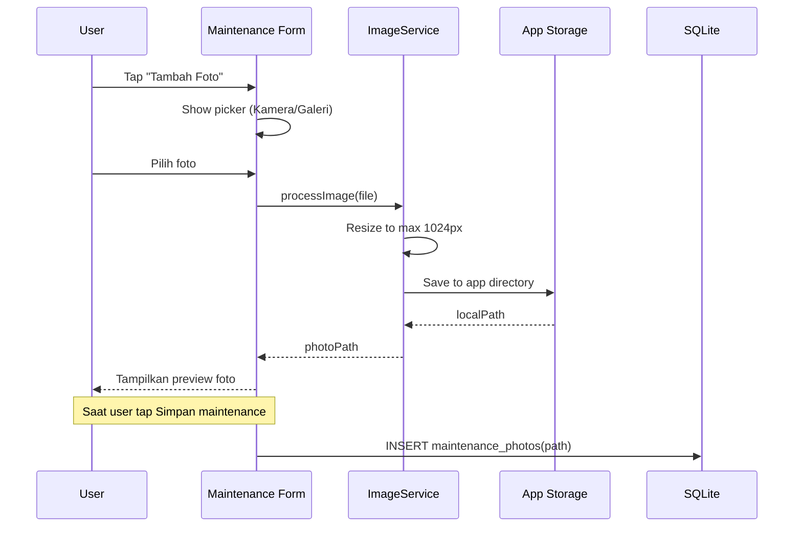

# Design Document: Premium Features

## Overview

Paket fitur premium OtoBuzz mencakup 4 modul: Fuel/BBM Tracking, Dashboard Analytics (fl_chart), Dark Mode Toggle, dan Foto Attachment. Semua fitur mengikuti arsitektur Clean Architecture yang sudah ada (Presentation → Domain → Data) dengan BLoC pattern.

## Architecture



## Database Changes

### New Table: `fuel_records`

```sql
CREATE TABLE fuel_records (
  id TEXT PRIMARY KEY,
  vehicleId TEXT NOT NULL,
  liters REAL NOT NULL,
  pricePerLiter REAL NOT NULL,
  totalCost REAL NOT NULL,
  odometerKm REAL NOT NULL,
  date TEXT NOT NULL,
  stationName TEXT,
  fuelType TEXT,
  isFullTank INTEGER NOT NULL DEFAULT 1,
  notes TEXT,
  FOREIGN KEY (vehicleId) REFERENCES vehicles(id) ON DELETE CASCADE
);
CREATE INDEX idx_fuel_vehicle_date ON fuel_records(vehicleId, date);
```

### Modified Table: `vehicles`
Add column:
```sql
ALTER TABLE vehicles ADD COLUMN photoPath TEXT;
```

### New Table: `maintenance_photos`

```sql
CREATE TABLE maintenance_photos (
  id TEXT PRIMARY KEY,
  maintenanceRecordId TEXT NOT NULL,
  photoPath TEXT NOT NULL,
  createdAt TEXT NOT NULL,
  FOREIGN KEY (maintenanceRecordId) REFERENCES maintenance_records(id) ON DELETE CASCADE
);
CREATE INDEX idx_photos_maintenance ON maintenance_photos(maintenanceRecordId);
```

## Data Models

### FuelRecord
```dart
class FuelRecord {
  final String id;
  final String vehicleId;
  final double liters;
  final double pricePerLiter;
  final double totalCost;
  final double odometerKm;
  final DateTime date;
  final String? stationName;
  final String? fuelType;
  final bool isFullTank;
  final String? notes;
}
```

### FuelStatistics
```dart
class FuelStatistics {
  final double averageKmPerLiter;
  final double totalLiters;
  final double totalCost;
  final double averageCostPerKm;
  final String trend; // 'improving', 'worsening', 'stable'
  final List<MonthlyFuelSummary> monthlySummaries;
}
```

### MaintenancePhoto
```dart
class MaintenancePhoto {
  final String id;
  final String maintenanceRecordId;
  final String photoPath;
  final DateTime createdAt;
}
```

## New BLoCs

### FuelBloc
- Events: `LoadFuelRecords`, `AddFuelRecord`, `DeleteFuelRecord`, `LoadFuelStatistics`
- States: `FuelInitial`, `FuelLoading`, `FuelLoaded`, `FuelStatisticsLoaded`, `FuelError`

### AnalyticsBloc
- Events: `LoadAnalytics`, `ChangeAnalyticsPeriod`, `ChangeAnalyticsVehicle`
- States: `AnalyticsInitial`, `AnalyticsLoading`, `AnalyticsLoaded`, `AnalyticsError`

### ThemeCubit
- Simple Cubit with `ThemeMode` state (light/dark/system)
- Persists to SharedPreferences

## Sequence Diagrams

### Fuel Record Input Flow



### Photo Attachment Flow



## UI Layout

### Fuel/BBM Tab
- Tambah tab baru di bottom navigation: "BBM" (icon: local_gas_station)
- Halaman utama: ringkasan statistik di atas, daftar riwayat di bawah
- FAB untuk tambah record baru
- Bottom navigation menjadi 5 tab: Beranda, Kendaraan, Input KM, BBM, Laporan

### Analytics Dashboard
- Diakses dari tombol "Analytics" di Beranda (bukan tab baru)
- Layout scroll vertikal: Summary Cards → KM Chart → Biaya Chart → BBM Chart
- Setiap chart punya dropdown filter kendaraan dan periode

### Settings
- Akses dari icon gear di AppBar Beranda
- Simple list: Tema, Backup & Restore, Tentang Aplikasi

### Photo Components
- Vehicle card: circular avatar dengan foto atau icon default
- Maintenance form: row of photo thumbnails dengan tombol +
- Photo viewer: full screen dengan pinch-to-zoom

## Package Dependencies (New)

```yaml
dependencies:
  fl_chart: ^0.69.0        # Charts & graphs
  image_picker: ^1.1.2     # Camera/gallery access
  image: ^4.3.0            # Image resizing
  path_provider: ^2.1.5    # Already exists - for photo storage
  shared_preferences: ^2.3.4  # Already exists - for theme
```

## File Structure (New Files)

```
lib/
├── data/
│   ├── repositories/
│   │   ├── fuel_repository.dart
│   │   └── photo_repository.dart
│   └── services/
│       ├── image_service.dart
│       └── theme_service.dart
├── domain/
│   └── models/
│       ├── fuel_record.dart
│       ├── fuel_statistics.dart
│       └── maintenance_photo.dart
├── presentation/
│   ├── blocs/
│   │   ├── fuel/
│   │   │   ├── fuel_bloc.dart
│   │   │   ├── fuel_event.dart
│   │   │   └── fuel_state.dart
│   │   ├── analytics/
│   │   │   ├── analytics_bloc.dart
│   │   │   ├── analytics_event.dart
│   │   │   └── analytics_state.dart
│   │   └── theme/
│   │       └── theme_cubit.dart
│   ├── screens/
│   │   ├── fuel_screen.dart
│   │   ├── fuel_form_screen.dart
│   │   ├── analytics_screen.dart
│   │   ├── settings_screen.dart
│   │   └── photo_viewer_screen.dart
│   └── widgets/
│       ├── fuel_stats_card.dart
│       ├── km_chart_widget.dart
│       ├── cost_chart_widget.dart
│       ├── fuel_chart_widget.dart
│       ├── photo_picker_widget.dart
│       └── vehicle_photo_avatar.dart
```
